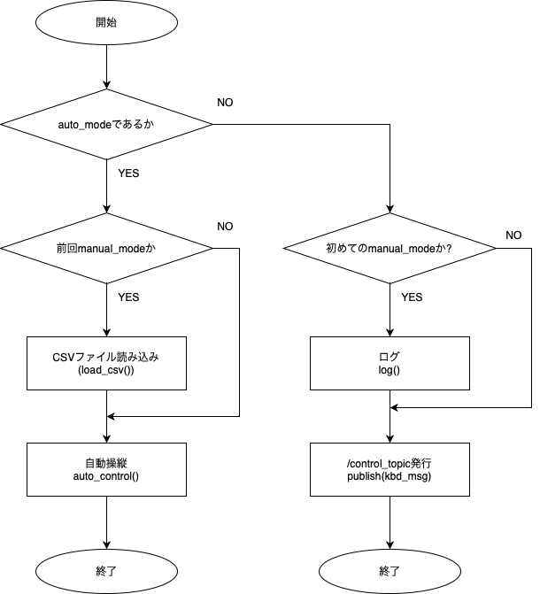
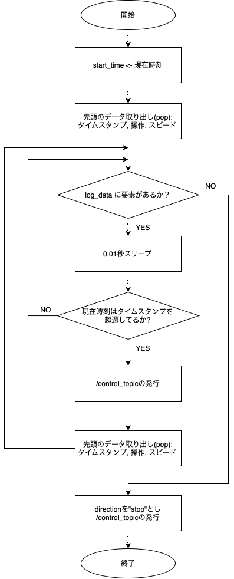

## MainControllerノード　概要

本ノードはKeyBoardControllerノードがユーザによる操作から決定した状態に基づき、
操作の反映、操作ログの作成、ログに基づく自動操縦のための情報を生成するノードである。

本ノードの主な機能は2つある:
1. 手動モードのとき、/keyboard_controlトピック内の操作内容を記録しつつ、
   /control_topicとして全く同じデータを発行する。
2. 自動モードに切り替わったとき、順走か逆走かに基づきログを加工して操作情報を生成する。

この2機能を実現するために本ノードには4つの要なメソッドがある:
1. MainController.mode_toggle_callback(self, kbd_msg: String) -> None
2. MainController.log(self, kbd_msg: String) -> None
3. MainController.load_csv(self, reverse:bool) -> None
4. MainController.auto_control(self) -> None

それぞれについて述べる。

### 1. mode_toggle_callback(self, kbd_msg: String) -> None
本メソッドは、/keyboard_controlトピックを受信した際に呼ばれるメソッドである。

manual_modeがtrueであれば、トピックのデータをそのまま/control_topicとして発行し、
操作のMainController.logメソッドでログを取る。

トピック内の'auto_mode'がtrueであれば、順行か逆行かチェックした上で自動モードに切り替え、
MainController.auto_controlをコールする。

なお、今回は記憶できるルートを1つのみとしたため、1度自動モードに移行した以降に再び手動モードに切り替えても、
操作のログは記録しない。

処理の流れを以下のフローチャートに示す。

### 2. log(self, kbd_msg: String) -> None
このメソッドは、/keyboard_controlトピック内のdirection, speedと
タイムスタンプをCSVファイルに記録するメソッドである。

引数としてString型の/keyboard_controlを受け取ったあと、それをパースしdirectionとspeedを取得する。
加えて、現在時刻を取得する。

以上の情報を、{タイムスタンプ},{direction},{speed}の形式でCSVファイルに追記する。

### 3. load_csv(self, reverse: bool) -> None
このメソッドはCSVファイルのログを読み出し、順走モードか逆走モードかに基づいて加工し、
メモリに格納するメソッドである。

このメソッドは次のようなアルゴリズムで動作する:
1. ファイルを読み込み、各行を要素とする配列に格納する
2. 各行に対し、カンマ区切りの文字列から、(タイムスタンプ(float), 方向(str), スピード(int))のタプルに変換する。
3. 行の先頭のタイムスタンプが0になるよう、各行のタイムスタンプからログの起点のタイムスタンプの値を引く。
4. 順走モードの場合、ここで終了。逆走モードの場合引き続き処理
5. 配列の順番を逆転させる。
6. それぞれの操作を反転させる。(例: forward -> backward, right -> left, stop -> stop)
7. タイムスタンプに-1を掛け、先頭要素のタイムスタンプ（すなわち最後の操作が行われ際のタイムスタンプ)を足す。また、起点のタイムスタンプを再度引く。
8. 方向とスピードを1行前に送る。(最後尾には('stop', 1)を加える)
9. 終了する。

以下に各ステップにおけるログの例を表に示す。

1. ステップ2: パース

| タイムスタンプ | direction  | speed |
|:-------:|:----------:|:-----:|
|   t0    | 'forward'  |   1   |
|   t1    |   'left'   |   1   |
|   t2    | 'forward'  |   1   |
|   t3    | 'backward' |   2   |
|   t4    |  'right'   |   2   |
|   t5    | 'forward'  |   1   |
|   t6    |   'stop'   |   1   |

2. ステップ3: タイムスタンプの標準化

| タイムスタンプ | direction  | speed |
|:-------:|:----------:|:-----:|
| t0 - t0 | 'forward'  |   1   |
| t1 - t0 |   'left'   |   1   |
| t2 - t0 | 'forward'  |   1   |
| t3 - t0 | 'backward' |   2   |
| t4 - t0 |  'right'   |   2   |
| t5 - t0 | 'forward'  |   1   |
| t6 - t0 |   'stop'   |   1   |

3. ステップ5: 時間方向の反転

| タイムスタンプ | direction  | speed |
|:-------:|:----------:|:-----:|
| t6 - t0 |   'stop'   |   1   |
| t5 - t0 | 'forward'  |   1   |
| t4 - t0 |  'right'   |   2   |
| t3 - t0 | 'backward' |   2   |
| t2 - t0 | 'forward'  |   1   |
| t1 - t0 |   'left'   |   1   |
|    0    | 'forward'  |   1   |

4. ステップ6: 操作の反転

| タイムスタンプ | direction  | speed |
|:-------:|:----------:|:-----:|
| t6 - t0 |   'stop'   |   1   |
| t5 - t0 | 'backward' |   1   |
| t4 - t0 |   'left'   |   2   |
| t3 - t0 | 'forward'  |   2   |
| t2 - t0 | 'backward' |   1   |
| t1 - t0 |  'right'   |   1   |
|    0    |   'left'   |   1   |

5. ステップ7: タイムスタンプのシフト

|      タイムスタンプ      | direction  | speed |
|:-----------------:|:----------:|:-----:|
| t0 - (t6-t0) - t0 |   'stop'   |   1   |
| t0 - (t5-t0) - t0 | 'backward' |   1   |
| t0 - (t4-t0) - t0 |   'left'   |   2   |
| t0 - (t3-t0) - t0 | 'forward'  |   2   |
| t0 - (t2-t0) - t0 | 'backward' |   1   |
| t0 - (t1-t0) - t0 |  'right'   |   1   |
|      t0 - t0      |   'left'   |   1   |

6. ステップ8: 操作のシフト

|   タイムスタンプ    | direction  | speed |
|:------------:|:----------:|:-----:|
| t6 - (t6-t0) | 'backward' |   1   |
| t6 - (t5-t0) |   'left'   |   2   |
| t6 - (t4-t0) | 'forward'  |   2   |
| t6 - (t3-t0) | 'backward' |   1   |
| t6 - (t2-t0) |  'right'   |   1   |
| t6 - (t1-t0) |   'left'   |   1   |
|      t6      |   'stop'   |   1   |

### 4. auto_control(self) -> None
このメソッドは、load_csv()で作成したメモリ内の操作ログに基づき/control_topicを発行するメソッドである。

メモリ内の操作列を1行ずつ見ていき、適切なタイミングでトピックを発行することで動作の指示を与える。
以下にフローチャートを示す。

## /control_topicの仕様
/keyboard_topicと全く同じデータ構造を持っているため、説明を省略する。

## 実装の工夫
本ノードの実装の工夫点は2つある。

1つ目は、本ノードが発行する/control_topicトピックの形式をを入力の/keyboard_topicのものと全く同一にした点である。
そのため、The Routerの開発に取り掛かる前に原型が完成していたKeyBoardTalkerとTrapeControllerの内部実装を
ほとんど変更せずに開発を進めることができ、開発工程の削減に繋がった。

2つ目はログの記録方式としてCSVファイルを採用したことである。
トピック通信として採用したJSONとは異なり、
データ全体をメモリに収めずとも1行ずつ書き込んだり処理したりできるためである。
実装では、読み込みの際はインメモリで処理したものの、CSVを採用したことで逐次処理への拡張も容易となった。

