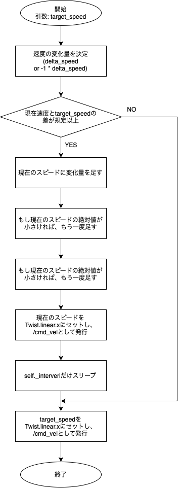

## TrapeControllerノード 
このノードでは、/control_topicトピックを受信するたびに、現在の速度から目標速度に達するまで線形に加減速を行う。
加減速を行うために、Raspberry Pi Mouseに組み込まれている/cmd_velトピックを使用した。
このトピックはTwist型のデータをもち、Twist.linear.xにセットされたfloat型の数値で前進後進を、
Twist.angular.zにセットされた数値で左右の旋回を行う。

ノード内で特に重要なメソッドは次の3つである:
1. TrapeController.listener_callback(self, msg: String) -> None
2. TrapeController._set_sped(self, target_speed: float) -> None
3. TrapeCtonrroller._turn(self, direction: str) -> None

それぞれについて概用を説明する。

### 1. listener_callback(self, msg: String) -> None
本メソッドは、/control_topicが発行されるたびに受動的にコールされるコールバック関数である。
引数として、String型の/control_topicを受け取る。

トピック内のJSONをパースし、/control_topic.speedを元に目標スピード(変数target_speed: float)を計算したあと、
/control_topic.directionの値に基づき次のように処理する。
- "immd_stop": 台形制御を行わず、ただちにモータの回転を止め、終了
- "stop": _set_speed(0.0)をコールし終了
- "right", "left": _turn()をコールし終了
- "forward": _set_speed(target_speed)をコールし終了
- "backward": _set_speed(-1 * target_speed)をコールし終了

### 2. _set_speed(self, target_speed: float)

本メソッドは、現在の速度からtarget_speedとの差が許容範囲に達するまで、
段階的に加減速を行うために/cmd_velを一定間隔で発行するメソッドである。

具体的には次に示すフローチャートにより決定する。
ここで、速度変更の最小単位であるdelta_speedは0.1、許容される最小のスピードは0.07、
速度変更の間隔の秒数intervalは0.05である。
これらの値は数個のパターンを検証し、任意に設定した。

### 3. _turn(self, direction: str) -> None
本メソッドは、その場で旋回する機能を実装している。
当初は台形制御により段階的に旋回速度を調節していたものの、操作性の向上を理由に即座に適用するよう変更した。

そのため、現在速度に関わらず、即座に前後方向の速度を0にし、
directionが"right"、すなわち右旋回であれば-1.57を、"left"であれば1.57をTwist.angular.zにセットし
/cmd_velトピックを発行する。

## 実装上の工夫
